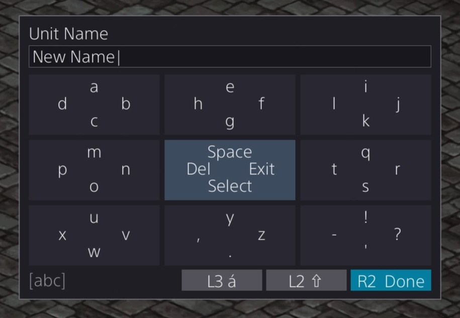

# PS4 Custom IME

A custom Input Method Editor (IME) for PlayStation 4, replacing the system on-screen keyboard with a compact 3x3 grid interface controlled entirely via the DualShock 4 controller. Built as a [GoldHEN](https://github.com/GoldHEN/GoldHEN) plugin.

## Demo



https://github.com/Zenalios/ps4-thumbgrid-ime/raw/main/ps4-thumbgrid-ime-demo.mp4

## Overview

When a PS4 game opens a text input dialog (`sceImeDialogInit`), this plugin intercepts it and presents a ThumbGrid — a 3x3 cell grid navigated with the analog stick — instead of Sony's default keyboard. Face buttons (Triangle, Circle, Cross, Square) input the character shown at that position in the selected cell.

The input method is inspired by the on-screen keyboard from [PSPXTI](https://github.com/PSP-Archive/PSPXTI), a TI-92 calculator emulator for PSP by Ludovic Jacomme (ZX-81), which used the same analog stick + face button grid concept.

The system consists of two PRX modules:

- **`thumbgrid_ime.prx`** (game-side) — Hooks IME dialog functions, handles controller input, manages the text session, and writes state to shared memory.
- **`shell_overlay.prx`** (shell-side) — Runs inside `SceShellUI`, reads shared memory, and renders the visual overlay using Sony's PUI widget framework via the Mono runtime.

## Features

- 3x3 cell grid with diamond-layout face button labels per cell
- Three character pages: lowercase (`abc`), uppercase (`ABC`), symbols (`123`)
- L2 hold for temporary shift (page toggle while held)
- L3 (left stick click) for accent mode toggle (e.g. a -> a, e -> e, n -> n)
- L2 + center cell for clipboard operations (Cut, Copy, Paste) and Caps Lock
- X hold + D-pad for text selection with visual highlight
- R2 to submit, Circle on center cell to cancel/exit
- Right analog stick to reposition the widget on screen
- L1/R1 to toggle symbol page
- Backspace hold-to-repeat with acceleration
- Full cursor movement (D-pad left/right, up=Home, down=End)
- Select All, Cut, Copy, Paste
- UTF-16 text support (Japanese titles display correctly)
- PUI overlay with PS4 dark theme styling
- Lock-free IPC between game and shell processes

## Controls

### Default (Neutral Stick)

| Input | Action |
|-------|--------|
| Left Stick | Select cell (3x3 grid) |
| Triangle / Circle / Cross / Square | Input character at that position in selected cell |
| D-pad Left/Right | Move text cursor |
| D-pad Up/Down | Home / End |
| L1 / R1 | Toggle symbol page |
| R2 | Submit text |
| Right Stick | Reposition widget |

### Center Cell (Stick Neutral)

| Button | Action |
|--------|--------|
| Triangle | Space |
| Circle | Exit IME |
| Cross | Select All (hold + D-pad for selection) |
| Square | Del (backspace, hold to repeat) |

### L2 Held (Shift Mode)

While holding L2, the character page toggles (lowercase <-> uppercase). The center cell buttons change to clipboard operations:

| Button | Action |
|--------|--------|
| Triangle | Paste |
| Circle | Caps Lock (page stays after L2 release) |
| Cross | Cut |
| Square | Copy |

### Text Selection

Hold Cross + D-pad to select text. The selection is highlighted in blue. Selected text can be cut/copied with L2+center cell, or replaced by typing.

### Accent Mode

Press L3 (left stick click) to toggle accent mode. When active, supported letters show their accented forms (a->a, e->e, i->i, o->o, u->u, n->n and uppercase equivalents).

## Prerequisites

- **PS4** with [GoldHEN](https://github.com/GoldHEN/GoldHEN) installed
- **Linux** build host (tested on WSL2)
- **[OpenOrbis PS4 Toolchain](https://github.com/OpenOrbis/OpenOrbis-PS4-Toolchain)** — Cross-compiler and PS4 SDK
- **[GoldHEN Plugins SDK](https://github.com/GoldHEN/GoldHEN_Plugins_SDK)** — Plugin framework and Detour library
- **clang**, **lld**, **llvm** (system packages)

## Building

### 1. Set environment variables

```bash
export OO_PS4_TOOLCHAIN=/path/to/OpenOrbis/PS4Toolchain
export GOLDHEN_SDK=/path/to/GoldHEN_Plugins_SDK
```

### 2. Build the GoldHEN Plugins SDK (if not already built)

```bash
cd $GOLDHEN_SDK
make
```

### 3. Build both PRX modules

```bash
# Game-side plugin
cd custom-ime
make clean && make

# Shell overlay
cd shell-overlay
make clean && make
```

This produces:
- `bin/thumbgrid_ime.prx` — Game-side plugin
- `shell-overlay/bin/shell_overlay.prx` — Shell-side overlay

## Installation

### 1. Deploy via FTP

Connect to your PS4's FTP server (GoldHEN enables this):

```bash
# Game-side plugin (auto-loaded by GoldHEN for all games)
curl -T bin/thumbgrid_ime.prx ftp://<PS4_IP>:2121/data/GoldHEN/plugins/

# Shell overlay (loaded into SceShellUI by the game-side plugin)
curl -T shell-overlay/bin/shell_overlay.prx ftp://<PS4_IP>:2121/user/data/
```

Replace `<PS4_IP>` with your PS4's IP address.

### 2. Enable the plugin

Add the plugin to the `[default]` section of `/data/GoldHEN/plugins.ini` on your PS4 so it loads for all games:

```ini
; GoldHEN Plugins

[default]
/data/GoldHEN/plugins/thumbgrid_ime.prx
```

If you already have other plugins listed under `[default]`, just add the `thumbgrid_ime.prx` line alongside them. You can also load it for a specific game only by placing it under that game's title ID section (e.g. `[CUSA00001]`) instead.

### 3. Reboot

Reboot the PS4 (or restart the game). The custom IME will activate whenever a game opens a text input dialog.

## Architecture

```
Game Process                          SceShellUI Process
+-----------------------+            +----------------------+
| thumbgrid_ime.prx     |            | shell_overlay.prx    |
|                       | file-backed|                      |
| IME Dialog Hooks      |   mmap     | Mono Runtime Attach  |
| Controller Input      | ---------> | PUI Widget Tree      |
| ImeSession State      | thumbgrid  | Label/Panel Updates  |
| ThumbGrid Engine      | _ipc.bin   | ~30Hz Poll Thread    |
+-----------------------+            +----------------------+
```

### IPC Protocol

Communication uses a file-backed `mmap` at `/user/data/thumbgrid_ipc.bin` (accessible to both process sandboxes). The protocol is lock-free using a sequence counter:

- **Writer** (game-side): `seq++` (odd = writing), write data, `seq++` (even = ready)
- **Reader** (shell-side): Read `seq`, copy data, read `seq` again. Valid only if both reads match and are even.

### Key Source Files

| File | Description |
|------|-------------|
| `src/ime_hook.c` | IME dialog function hooks, controller input processing, main logic |
| `src/ime_custom.c` | Text session state machine (cursor, selection, clipboard, submit) |
| `src/thumbgrid.c` | ThumbGrid 3x3 grid engine (pages, cell layout, accent mapping) |
| `src/input.c` | Controller input edge detection and action mapping |
| `include/thumbgrid_ipc.h` | Shared IPC struct definition with sequence counter helpers |
| `shell-overlay/src/main.c` | PUI overlay (Mono runtime, widget tree, IPC reader) |

## Credits and References

### Inspiration

- **[PSPXTI](https://github.com/PSP-Archive/PSPXTI)** by Ludovic Jacomme (ZX-81) — TI-92 calculator emulator for PSP whose on-screen keyboard used a 3x3 analog stick grid with face button input, the direct inspiration for this project's input method (GPL-2.0 License)

### Dependencies

- **[GoldHEN](https://github.com/GoldHEN/GoldHEN)** by SiSTRo — PS4 homebrew enabler that provides the plugin loading framework
- **[GoldHEN Plugins SDK](https://github.com/GoldHEN/GoldHEN_Plugins_SDK)** — Plugin development SDK with Detour hooking library (MIT License)
- **[OpenOrbis PS4 Toolchain](https://github.com/OpenOrbis/OpenOrbis-PS4-Toolchain)** — Cross-compilation toolchain for PS4 (GPL-3.0 License, used as build tool only)
- **[font8x8](https://github.com/dhepper/font8x8)** by Daniel Hepper — 8x8 bitmap font used in the legacy framebuffer overlay fallback (Public Domain)

### Technical References

- PS4 system libraries: `libSceImeDialog`, `libScePad`, `libSceVideoOut`, `libkernel`
- Sony PUI (PlayStation UI) framework — C#/.NET widget system in `SceShellUI`, accessed via Mono embedding API
- `OrbisPadData` struct for DualShock 4 input (buttons bitmask, analog sticks, L2/R2 analog triggers)

## License

This project is licensed under the [MIT License](LICENSE).

This is a clean-room implementation inspired by the PSPXTI input concept. No code from PSPXTI is used. The OpenOrbis PS4 Toolchain (GPL-3.0) is used solely as a build tool and is not linked into or distributed with this software.
